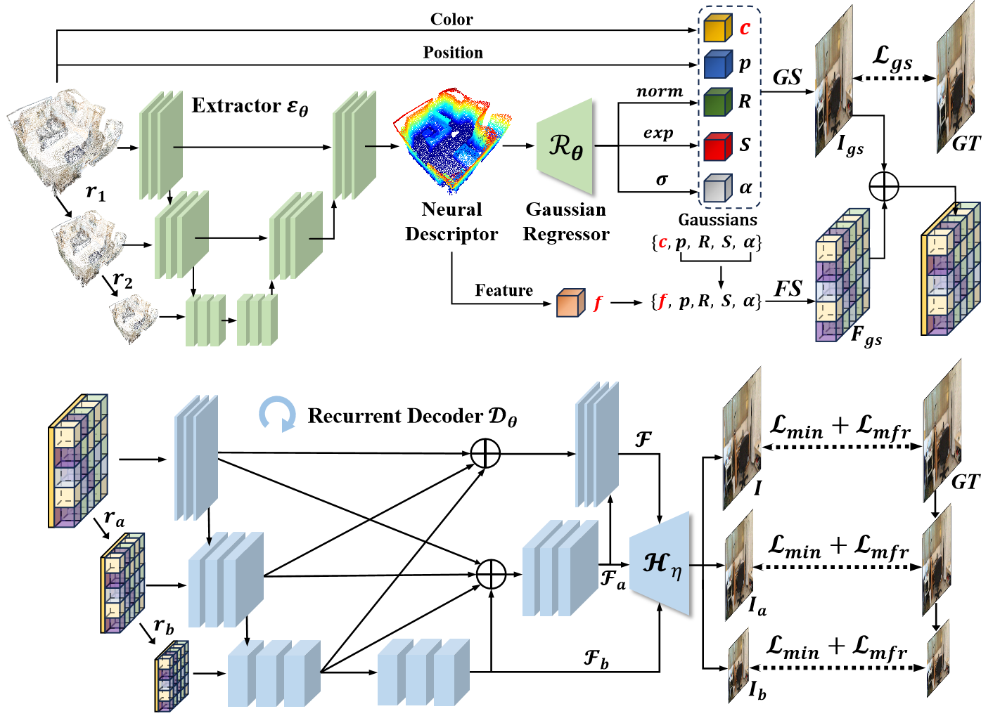

# PFGS: High Fidelity Point Cloud Rendering via Feature Splatting
<!-- 

 -->

> [PFGS: High Fidelity Point Cloud Rendering via Feature Splatting](https://arxiv.org/abs/2407.03857)       
> Jiaxu Wang<sup>†</sup>, Ziyi Zhang<sup>†</sup>, Junhao He, Renjing Xu*    
> ECCV 2024
> 

 


If you found this project useful, please [cite](#citation) us in your paper, this is the greatest support for us.

### Requirements (Tested on 1 * RTX3090)
- Linux
- Python == 3.8
- Pytorch == 1.13.0
- CUDA == 11.7

## Installation

### Install from environment.yml
You can directly install the requirements through:
```sh
$ conda env create -f environment.yml
```

### Or install packages seperately
* Create Environment
    ```sh
    $ conda create --name PFGS python=3.8
    $ conda activate PFGS
    ```

* Pytorch (Please first check your cuda version)
    ```sh
    $ conda install pytorch==1.13.0 torchvision==0.14.0 torchaudio==0.13.0 pytorch-cuda=11.7 -c pytorch -c nvidia
    ```
* Other python packages: open3d, opencv-python, etc.

### Gaussian Rasterization with High-dimensional Features
```shell
pip install ./submodules/diff-gaussian-rasterization
```
You can customize `NUM_SEMANTIC_CHANNELS` in `submodules/diff-gaussian-rasterization/cuda_rasterizer/config.h` for any number of feature dimension that you want: 

### Install third_party

## Dataset
#### ScanNet:
- Download and extract data from original [ScanNet-V2 preprocess](https://github.com/ScanNet/ScanNet/tree/master/SensReader/python).
  
- Dataset structure:
  ```
  ── scannet
    └── scene0000_00
        ├── pose
              └──1.txt
         ├── intrinsic
              └──*.txt
        ├── color
               └──1.jpg
        └── scene0000_00_vh_clean_2.ply
        └── images.txt
    └── scene0000_01
   ```
- [Pretrain](https://1drv.ms/u/c/747194122a3acf02/EQzE6ue3ZglLsUbfVP8uDk8BJa4C_sfILsqd5fjo5L4Dug?e=eslXip)
#### DTU: 
- We reorganize the original datasets in our own format. Here we provide a demonstration of the test set of DTU, which can be downloaded [here](https://1drv.ms/u/c/747194122a3acf02/EdwjDcTXBwpAmyKqDEqjsZMBiUoxXpJ2o1QCYdt8WmMGOA?e=nvceS7)
- [Pretrain](https://1drv.ms/u/c/747194122a3acf02/EQzE6ue3ZglLsUbfVP8uDk8BJa4C_sfILsqd5fjo5L4Dug?e=eslXip)

#### THuman2:
- Download 3D model and extract data from original [THuman2](https://github.com/ytrock/THuman2.0-Dataset).
- Render 36 views based on each 3D model and sparse sample points(8w) on the surface of the model by Blender.
- [Demo](https://1drv.ms/u/c/747194122a3acf02/EbCeCGAeY7hKgW28xfp3XvUB7snppGkG7dnumzg-eW7lVg?e=fanaHb) and [Pretrain](https://1drv.ms/u/c/747194122a3acf02/EQzE6ue3ZglLsUbfVP8uDk8BJa4C_sfILsqd5fjo5L4Dug?e=eslXip)

## Train Stage 1
#### ScanNet:
```shell
python train_stage1.py --dataset scannet --scene_dir $data_path --exp_name scannet_stage1 --img_wh 640 512
```
#### DTU:
```shell
python train_stage1.py --dataset dtu --scene_dir $data_path --exp_name dtu_stage1 --img_wh 640 512
```
#### THuman2:
```shell
python train_stage1.py --dataset thuman2 --scene_dir $data_path --exp_name thuman2_stage1 --img_wh 512 512 --scale_max 0.0001
```

## Train Stage 2
#### ScanNet:
```shell
python train_stage2.py --dataset scannet --scene_dir $data_path --exp_name scannet_stage2 --img_wh 640 512 --ckpt_stage1 $ckpt_stage1_path
```
#### DTU:
```shell
python train_stage2.py --dataset dtu --scene_dir $data_path --exp_name dtu_stage2 --img_wh 640 512 --ckpt_stage1 $ckpt_stage1_path
```
#### THuman2:
```shell
python train_stage1.py --dataset thuman2 --scene_dir $data_path --exp_name thuman2_stage1 --img_wh 512 512 --scale_max 0.0001 --ckpt_stage1 $ckpt_stage1_path
```

## Eval
#### ScanNet:
```shell
python train_stage2.py --dataset scannet --scene_dir $data_path --exp_name scannet_stage2_eval --img_wh 640 512 --resume_path $ckpt_stage2_path --val_mode test
```
#### DTU:
```shell
python train_stage2.py --dataset dtu --scene_dir $data_path --exp_name dtu_stage2_eval --img_wh 640 512 --resume_path $ckpt_stage2_path --val_mode test
```
#### THuman2:
```shell
python train_stage1.py --dataset thuman2 --scene_dir $data_path --exp_name thuman2_stage1_eval --img_wh 512 512 --scale_max 0.0001 --resume_path $ckpt_stage2_path --val_mode test
```
The results will be saved in ./log/$exp_name

## Acknowledgements
In this repository, we have used codes or datasets from the following repositories. 
We thank all the authors for sharing great codes or datasets.
- [DTU](https://roboimagedata.compute.dtu.dk/?page_id=36)
- [ScanNet](https://github.com/ScanNet/ScanNet)
- [THuman2](https://github.com/ytrock/THuman2.0-Dataset)
- [Trivol](https://github.com/dvlab-research/TriVol)
- [3D Gaussian Splatting](https://repo-sam.inria.fr/fungraph/3d-gaussian-splatting/)
- [Feature-3DGS](https://github.com/ShijieZhou-UCLA/feature-3dgs)
- [LION](https://github.com/nv-tlabs/LION)
- [MIMO-UNet](https://github.com/chosj95/MIMO-UNet)

## Citation
```
@misc{wang2024pfgshighfidelitypoint,
      title={PFGS: High Fidelity Point Cloud Rendering via Feature Splatting}, 
      author={Jiaxu Wang and Ziyi Zhang and Junhao He and Renjing Xu},
      year={2024},
      eprint={2407.03857},
      archivePrefix={arXiv},
      primaryClass={cs.CV},
      url={https://arxiv.org/abs/2407.03857}, 
}
```